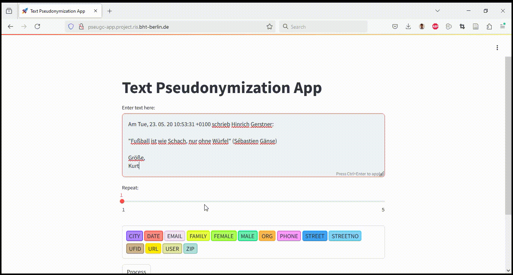

# pseugc

pseugc (**pse**udonymize **u**ser **g**enerated **c**ontent) is the project 
developed as the output of Master's thesis titled "_De-identification 
techniques with large language models_" by Saurav Kumar Saha as a requirement 
to complete the M.Sc. in Data Science from Berliner Hochschule für Technik 
(BHT). It was supervised by [Prof. Dr. rer. nat. Felix Bießmann](
https://prof.bht-berlin.de/biessmann/kontakt) and reviewed by 
[Prof. Dr. Selcan Ipek-Ugay](https://prof.bht-berlin.de/ipek-ugay/kontakt).

The thesis explores and develops different NER (Named Entity Recognition) 
models and pseudonymization techniques, ranging from training a BiLSTM-CRF 
based NER, fine-tuning transformers (e.g. GELECTRA) based NER or 
bi-directional encoder-decoder based text-to-text language model to prompting 
LLMs (Large Language Models), to detect private entities in 
unstructured German-language text documents and replace them with 
type-compliant and format preserving pseudonyms. A novel unified approach 
by fine-tuning a [mT5](https://aclanthology.org/2021.naacl-main.41.pdf)
-base text-to-text model is developed to both identify and generate 
pseudonyms with a single model by leveraging training data prepared from 
the two versions of German-language email corpus [CodE Alltag](
https://github.com/codealltag).

A [paper](039_Paper_AiMH_2025.pdf), with all the experiments and findings of 
this project, titled "_End-to-end Pseudonymization of German Texts with Deep 
Learning – An Empirical Comparison of Classical and Modern Approaches_" has 
been accepted for publication in the First International Conference on AI in 
Medicine and Healthcare ([AiMH' 2025](https://aimh-conference.com/)) 
8-10 April 2025, Innsbruck, Austria.

### Pseudonymization App
A containerized image of the developed pseudonymization tool with a 
simple user interface and a API endpoint is available at -

https://hub.docker.com/r/sksdotsauravs/pseugc-app

